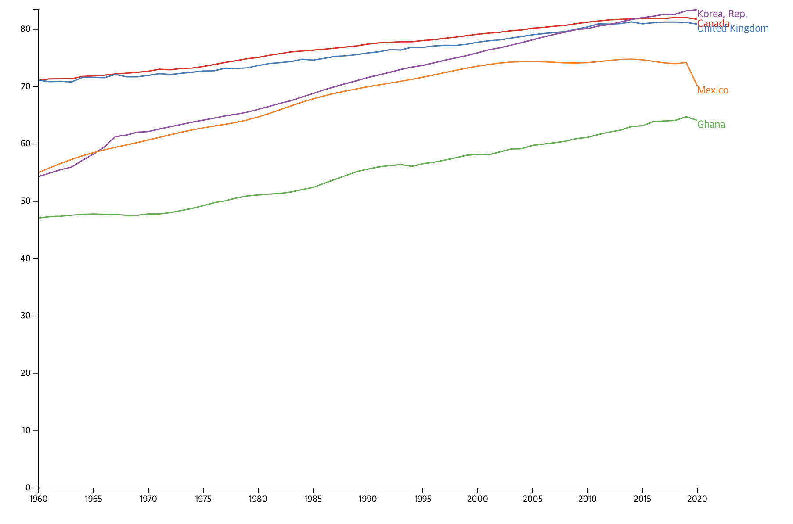

# Exercise1

## Description
In this exercise, you will create a line chart that shows the change in life expectancy by country. We will provide you with 60 years of life expectancy dataset, covering all countries in the world. Each row of the CSV file includes country code, country name, year, and life expectancy per country per year (written as “value”). Using this data, please generate the chart that satisfies the requirements.

### Data processing

When you filter the countries for drawing the chart, please consider a few things listed below.

1. Calculate the difference between the minimum and maximum life expectancy of a country.
2. Sort the countries by the value from step 1 in descending order.
3. Pick the top 5 countries to pass as an argument for the function ‘drawLineChart.’

### Presentation

You need to draw the lines of 5 countries that have the greatest difference between minimum and maximum life expectancy. When you present the data, please follow the guideline below.

1. Display years on the x-axis, ranging from the minimum to the maximum year.
2. Display the life expectancy on the y-axis, ranging from 0 to the maximum value.
3. Color the line differently depending on the country with the color palette of ['#e41a1c', '#377eb8', '#4daf4a', '#984ea3', '#ff7f00'].
4. Label each line with its corresponding country at the end of the line. Match the label text color to the line color.
5. Remove commas in x-axis tick labels to present years

### Example visualization

The final visualization will look like the chart below. The selected countries are just examples and should be different from this. 

